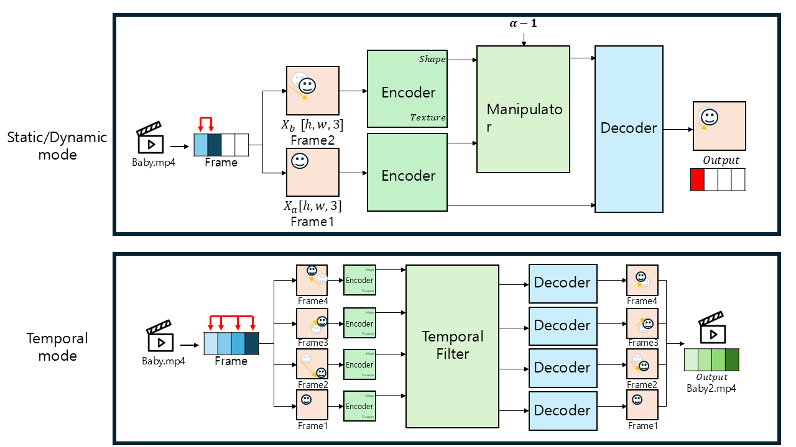
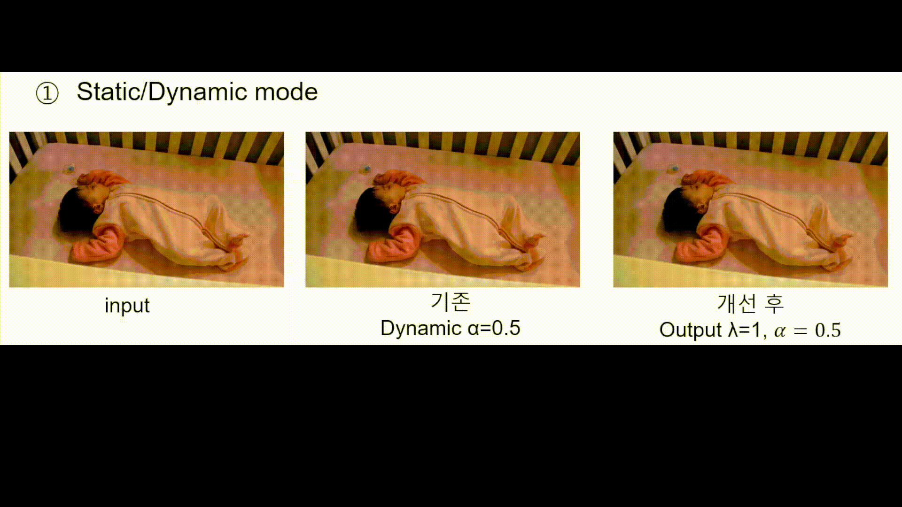
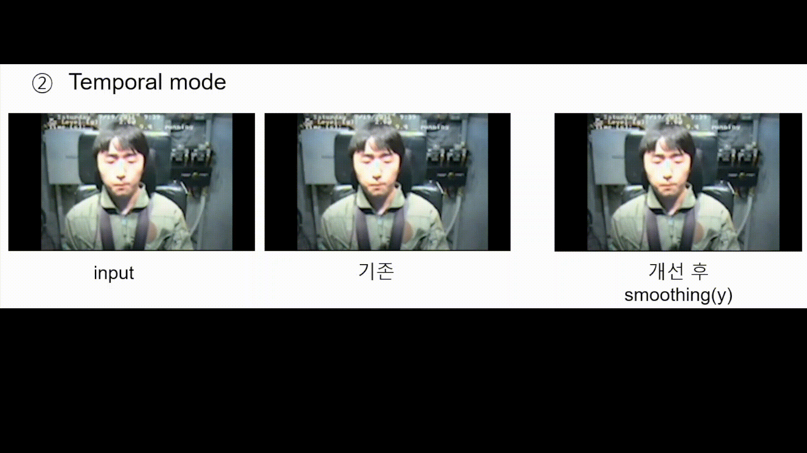

# Deep Motion **Smoothing**  
*(Based on 12dmodel/deep_motion_mag, MIT License)*

https://github.com/12dmodel/deep_motion_mag

---

## 📌 프로젝트 개요
본 프로젝트는 **모션 스무딩(Motion Smoothing)** 관점에서 DeepMag(ECCV'18) 구조를 재구성하여,  
영상에서 불필요한 (진동·노이즈)을 줄이고 **안정화 효과**를 얻는 것을 목표로 합니다.  

- **원본 DeepMag**: 움직임을 **증폭 (α > 1)**  
- **본 구현**: 움직임을 **감쇠 (α < 1)** → **Motion Smoothing**  

---

## 아키텍쳐


---

## ⚙️ 실행 방법 (How to Run)

### 1. Docker 환경 실행
```bash
docker run --gpus all -it --name deepmag-tf   -v /home/shchoi/deepmag:/workspace   tensorflow/tensorflow:1.15.5-gpu-py3 bash
```
> 컨테이너 이름: `deepmag-tf`, 작업 디렉토리: `/workspace`

### 2. 입력/출력 폴더 준비
```bash
# 데이터 폴더에 테스트 영상을 넣어야 함
deep_motion_mag/data/vids
```

### 3. 추론 (Inference)

#### (1) Static/Dynamic Mode
```bash
# Static mode, using first frame as reference
sh run_on_test_videos.sh o3f_hmhm2_bg_qnoise_mix4_nl_n_t_ds3 baby 10

# Dynamic mode, magnify difference between consecutive frames
sh run_on_test_videos.sh o3f_hmhm2_bg_qnoise_mix4_nl_n_t_ds3 baby 10 yes
```

#### (2) Temporal Mode
```bash
# Using temporal filter (same as Wadhawa et al.)
sh run_temporal_on_test_videos.sh o3f_hmhm2_bg_qnoise_mix4_nl_n_t_ds3 baby 20 0.04 0.4 30 2 differenceOfIIR
```

---

### 4. 학습 (Training)
```bash
bash train.sh configs/<your config file>.conf
```

---

## 🖥️ 코드 변경점 (What Changed)

본 프로젝트에서 수정된 핵심 코드 포인트는 다음과 같습니다.

1. **Loss Function 수정 (Motion Suppression Loss)**  
   - 출력이 첫 번째 프레임(`frameA`)에 가까워지도록 보조 loss 추가  
   - Ghosting 감소, suppression 효과 강화  

2. **Reverse Amplification (역증폭)**  
   - Manipulator에서 `enc_b - enc_a` 대신 `enc_a - enc_b` 사용  
   - 움직임을 반대 방향으로 증폭 → 실제 motion 감소  

3. **Temporal 모드 Sharpening/Gaussian 적용**  
   - 필터링된 feature `y`에 대해 Gaussian smoothing / Unsharp masking 선택 적용  
   - Ghosting 경계 완화 및 motion edge 유지  

---

## 코드 수정 – Motion Suppression Loss
```python
with tf.variable_scope('ynet_3frames/encoder', reuse=True):
    texture_c, shape_c = self._encoder(frameC)
    self.loss += train_config["texture_loss_weight"] * L1_loss(texture_c, self.texture_a)
    self.loss += train_config["shape_loss_weight"] * L1_loss(shape_c, self.shape_b)

# Motion suppression loss
motion_suppression_loss = L1_loss(self.output, frameA) * 0.5
self.loss += motion_suppression_loss
```

---

## 코드 수정 – Reverse Amplification
```python
# 기존 방식
diff = enc_b - enc_a
diff = (alpha - 1) * diff
return enc_b + diff

# 수정 방식 (역증폭)
diff = enc_a - enc_b
diff = (alpha - 1) * diff
return enc_a + diff
```

---

## 코드 수정 – Temporal 모드 Sharpening/Gaussian
```python
from scipy.ndimage import gaussian_filter

def sharpen_feature(x, alpha=0.8, sigma=1.0):
    blurred = gaussian_filter(x, sigma=sigma)
    return x + alpha * (x - blurred)

# run_temporal 내부
y = np.zeros_like(x)
for i in range(len(x_state)):
    y += x_state[i] * filter_b[i]
for i in range(len(y_state)):
    y -= y_state[i] * filter_a[i]

# ✅ Sharpening 적용
y = sharpen_feature(y, alpha=0.8, sigma=1.0)

# ✅ Gaussian 적용 (선택)
y = gaussian_filter(y, sigma=1.0)

y_state.insert(0, y)
```

---

## 📊 결과 (Results)

### 정성적 결과 (Before vs After)
static mode
- Before: 증폭 구조 그대로 사용 
- After: suppression/역증폭 


dynamic mode
- Before: 증폭 구조 그대로 사용 
- After: suppression/역증폭 

---

## 📖 라이선스 & 출처
- License: **MIT License** (레포 `LICENSE` 참조)  
- Based on: [12dmodel/deep_motion_mag](https://github.com/12dmodel/deep_motion_mag) (MIT)  
- 연구 배경/결과: 연구 참여 발표 슬라이드 (Week1~4)  
